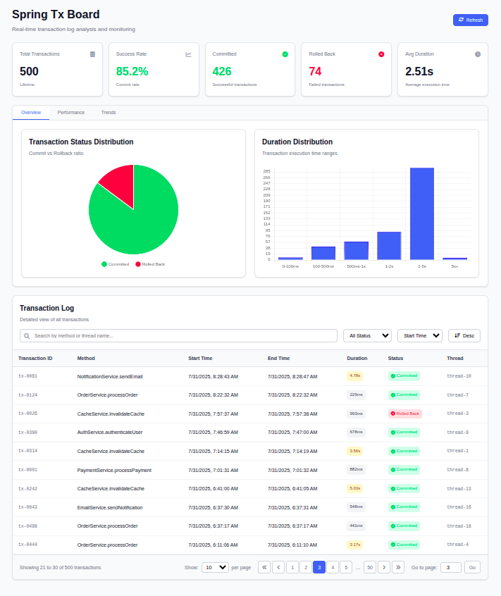

# Spring Tx Board

**Spring Tx Board** is a lightweight, auto-configurable transaction monitoring library for Spring-based applications. It allows developers to capture, analyze, and visualize transaction execution metrics such as duration, thread information, and status—all without requiring heavy instrumentation.



## Features

* Autoconfigures itself when added as a dependency
* Captures transaction start/end time, duration, thread, and method
* In-memory and Redis-based storage support
* Alarming threshold to flag slow transactions
* Lightweight API endpoint for fetching transaction logs
* Supports filtering, sorting, pagination, and duration distribution

---

## Getting Started

### 1. Add Dependency

Add the following dependency to your `pom.xml`:

```xml
<dependency>
  <groupId>com.github.Mamun-Al-Babu-Shikder</groupId>
  <artifactId>spring-tx-board</artifactId>
  <version>1.5.0</version>
</dependency>
```

### 2. Configuration

```yaml
sdlc.pro.spring.tx.board:
  enable: true
  alarming-threshold: 1000
  storage: IN_MEMORY  # or REDIS
  enable-listener-log: true
  duration-buckets: [100, 500, 1000, 2000, 5000]
```

> `alarming-threshold`: Transaction duration (ms) above which the transaction will be highlighted

## Storage Options

* **IN\_MEMORY** (default): Simple, thread-safe `List` with in-memory counters
* **REDIS** (planned): Store and distribute logs across instances (not-implemented)

## Developer Usage

Just annotate your service methods with `@Transactional` or use `TransactionTemplate`, and Spring Tx Board will automatically hook into them using transaction lifecycle listeners.

```java
import org.springframework.stereotype.Service;

@Service
public class OrderService {
    @Transactional
    public void placeOrder() {
        // Your logic here
    }
}
```

```java
import org.springframework.stereotype.Service;
import org.springframework.transaction.support.TransactionTemplate;

@Service
public class OrderService {
    @Autowired
    private TransactionTemplate template;
    
    @Transactional
    public void placeOrder() {
        template.executeWithoutResult(transactionStatus -> {
            // Your logic here
        });
    }
}
```

No additional annotations or API calls required.

## Utilities

### Duration Distribution

Calculates and buckets transaction durations into defined ranges like:

* `0-100ms`
* `100-500ms`
* `500ms+`

### Configuration Metadata

Spring Boot metadata support for IDE auto-completion is provided via `spring-configuration-metadata.json`.

## Future Enhancements

* Redis-backed storage with TTL
* Export to `CSV/JSON`
* Spring Boot Admin integration

## Contribution

Pull requests and feedback are welcome!

```
git clone https://github.com/Mamun-Al-Babu-Shikder/spring-tx-board
```

---

## Maintainer

**Spring Tx Board** — Built and maintained by `Abdulla-Al-Mamun` / SDLC.PRO
