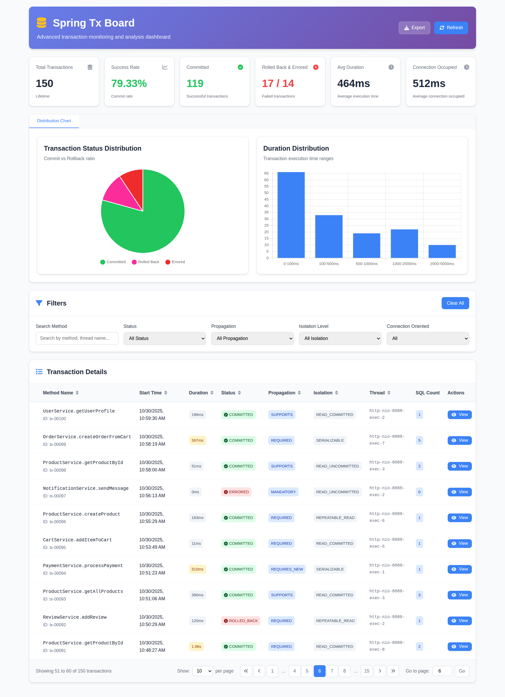

# Spring Tx Board

**Spring Tx Board** is a lightweight, auto-configurable transaction monitoring library for Spring-based applications. It
allows developers to capture, analyze, and visualize transaction execution metrics such as duration, thread information,
and status—all without requiring heavy instrumentation.



## Features

* Autoconfigures itself when added as a dependency
* Captures transaction start/end time, duration, thread, and method
* In-memory and Redis-based storage support
* Alarming threshold to flag slow transactions
* Lightweight API endpoint for fetching transaction logs
* Supports filtering, sorting, pagination, and duration distribution

---

## Getting Started

### 1. Add Dependency

Add the following dependency to your `pom.xml`:

```xml
<repositories>
    <repository>
        <id>jitpack.io</id>
        <url>https://jitpack.io</url>
    </repository>
</repositories>

<dependencies>
    <dependency>
        <groupId>com.github.Mamun-Al-Babu-Shikder</groupId>
        <artifactId>spring-tx-board</artifactId>
        <version>1.5.0</version>
    </dependency>
</dependencies>
```
> Published via JitPack.io

### 2. Configuration

```yaml
sdlc.pro.spring.tx.board:
  enable: true
  alarming-threshold: 1000
  storage: IN_MEMORY  # or REDIS
  enable-listener-log: true
  duration-buckets: [ 100, 500, 1000, 2000, 5000 ]
```

> `alarming-threshold`: Transaction duration (ms) above which the transaction will be highlighted

## Web UI

If your application includes Spring Web, a minimal built-in UI is accessible at:

> http://localhost:8080/tx-board/ui

This dashboard provides a real-time view of transaction activity including filtering, status, execution time, and more.

## Storage Options

* **IN\_MEMORY** (default): Simple, thread-safe `List` with in-memory counters
* **REDIS** (planned): Store and distribute logs across instances (not-implemented)

## Configurable transaction logging

Spring Tx Board emits a completion log when a transaction ends. You can choose between two logging modes via the property below:

- `sdlc.pro.spring.tx.board.log-type=SIMPLE` (default)
- `sdlc.pro.spring.tx.board.log-type=DETAILS`

**Health-based severity**
- Healthy transaction (<= alarming thresholds) logs at INFO level.
- Unhealthy transaction (exceeds transaction duration or connection occupied-time thresholds) logs at WARN level.

**Example configuration (YAML)**

```yaml
sdlc.pro.spring.tx.board:
  enable: true
  # select logging style
  log-type: DETAILS   # SIMPLE | DETAILS
  # thresholds used to determine INFO vs WARN
  alarming-threshold:
    transaction: 1000   # ms
    connection: 1000    # ms
```

### Examples

**SIMPLE** (healthy -> INFO)
```
Transaction [UserService.createUser] took 152 ms, Status: COMMITTED
```

**SIMPLE** (unhealthy -> WARN)
```
Transaction [UserService.createUser] took 2150 ms, Status: COMMITTED, Connections: 3, Queries: 12
```

**DETAILS** (healthy -> INFO)
```
[TX-Board] Transaction Completed:
  • ID: 123
  • Method: UserService.createUser
  • Status: COMMITTED
  • Duration: 152 ms
  • Connections Acquired: 2
  • Queries Executed: 5
  • Started At: 2025-08-17T10:15:30.123Z
  • Ended At: 2025-08-17T10:15:30.275Z
```

**DETAILS** (with inner transactions, unhealthy -> WARN)
```
[TX-Board] Transaction Completed:
  • ID: 789
  • Method: CheckoutService.checkout
  • Status: COMMITTED
  • Duration: 2200 ms
  • Connections Acquired: 4
  • Queries Executed: 18
  • Started At: 2025-08-17T10:15:30.123Z
  • Ended At: 2025-08-17T10:15:32.323Z
  • Inner Transactions:
      - InventoryService.reserveStock (450 ms, COMMITTED)
      - PaymentService.charge (1200 ms, COMMITTED)
      - EmailService.sendReceipt (120 ms, COMMITTED)
```

## Developer Usage

Just annotate your service methods with `@Transactional` or use `TransactionTemplate`, and Spring Tx Board will
automatically hook into them using transaction lifecycle listeners.

```java
import org.springframework.stereotype.Service;

@Service
public class OrderService {
    @Transactional
    public void placeOrder() {
        // Your logic here
    }
}
```

```java
import org.springframework.stereotype.Service;
import org.springframework.transaction.support.TransactionTemplate;

@Service
public class OrderService {
    @Autowired
    private TransactionTemplate template;

    @Transactional
    public void placeOrder() {
        template.executeWithoutResult(transactionStatus -> {
            // Your logic here
        });
    }
}
```

No additional annotations or API calls required.

## Utilities

### Duration Distribution

Calculates and buckets transaction durations into defined ranges like:

* `0-100ms`
* `100-500ms`
* `500ms+`

### Configuration Metadata

Spring Boot metadata support for IDE auto-completion is provided via `spring-configuration-metadata.json`.

## Future Enhancements

* Redis-backed storage with TTL
* Export to `CSV/JSON`
* Spring Boot Admin integration

## Contribution

Pull requests and feedback are welcome! See [CONTRIBUTING.md](CONTRIBUTING.md) for details.

## Maintainer

**Spring Tx Board** — Built and maintained by `Abdulla-Al-Mamun` / SDLC.PRO
